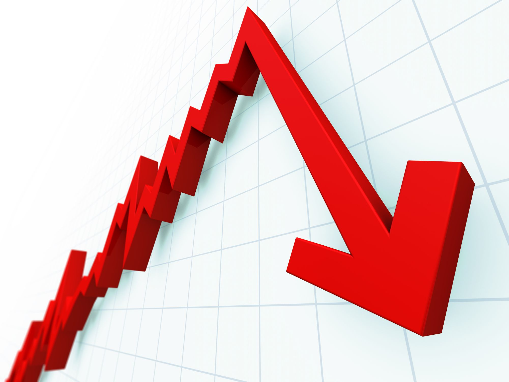

 

# Does the Market Move with Trump's Tweets?
**Identifying how the market correlates with the content and volume of Trump's tweets**
 Walker Stevens
\
[Linkedin](https://www.linkedin.com/in/walker-stevens-31783087/) | [Github](https://github.com/walker777007)
\
[Slides](https://docs.google.com/presentation/d/1CAraqaHrIOvwTRTMnkqVxcKBLObsxW4V1REe9X0WVw8/edit?usp=sharing)

## Table of Contents

* [Motivation](#motivation)
* [Data Exploration](#data-exploration)
  * [Pipeline](#pipeline)
  * [Evidence for the Motivation](#evidence-for-the-motivation)
  * [What is Trump Talking About?](#what-is-trump-talking-about?)
  * [Daily Effects](#daily-effects)
  * [Change Assumptions](#change-assumptions)
* [Hypothesis Testing](#hypothesis-testing)
  * [Set-Up](#set-up)
  * [Mann Whitney U Test](#mann-whitney-u-test)
* [Conclusion](#conclusion)

## Motivation

Donald Trump has been known for being quite "outspoken" on his twitter, and I have read a [host](https://www.mediaite.com/news/stock-market-plunges-223-points-in-5-minutes-after-trumps-stunning-china-tweets/) [of](https://www.barrons.com/articles/donald-trump-twitter-stock-market-51567803655) [articles](https://www.forbes.com/sites/johntobey/2019/09/07/how-tweet-risk-can-infect-your-stock-investing-and-how-to-avoid-harm/#2ab88f423330) discussing the relationship of his tweets with the stock market.  I was curious if I could quantify this relationship, to see if the content and volume of his tweets were correlated with market drops or increased volatility.

The indexes I used in this case are:

* **S&P500**: Represents the performance of 500 large companies listed on stock exchanges.
* **VIX**: Represents investor "fear". To quote Wikipedia, it "represents the expected range of movement in the S&P 500 index over the next month... For example, if the VIX is 15, this represents an expected annualized change, with a 68% probability, of less than 15% up or down."
* **Soybean Futures**: Represents the price of 5,000 bushels of soybeans.  The reason I chose this index, was due to the fact that China is a major importer of US soybeans, so it has been greatly affected by the trade war.

## Data exploration

### Pipeline

Where I got the data:
* Trump's Tweets: [Trump Twitter Archive](http://www.trumptwitterarchive.com/)
  * The Trump Twitter Archive provides a part of the twitter API data for every tweet Trump has ever tweeted.
* S&P500 and VIX Historical Data: [Yahoo! Finance](https://finance.yahoo.com/)
* Soybean Futures Historical Data: [Investing.com](https://www.investing.com/)

Once all the data CSV files were collected, I used pandas in order to group them into dataframes, and proceeded to do all my calculations and tests after.

### Evidence for the Motivation

The tariff period of Trump's presidency started in January of 2018, when he announced tariffs on solar panels and washing machines.  He would go on to announce additional tariffs on steel, aluminum, and goods at large from China.  

As we can see below, the market has been more volatile ever since.

On May 30th, 2019, [Trump threatened to introduce tariffs](https://www.cnn.com/2019/05/30/investing/mexico-tariffs-stock-reactions/index.html) on Mexico unless they stop illegal immigration into America, the Dow Jones Industrial Average dropped 385 points that day.

On August 23rd, at 10:57am, Trump proceeded to go on a twitter storm about the trade war with China.  Within 10 minutes, the Dow Jones Industrial Average had dropped 373 points.

Here we can see an illustration of that fateful moment.

Another interesting specific case is on May 9th, 2019 China decided to cancel soybean orders responding to tariffs Trump introduced beginning in March.  As a result, soybean futures plummetted, and Trump's twitter exploded.

 Here we can see an illustration this other fateful moment.

 

