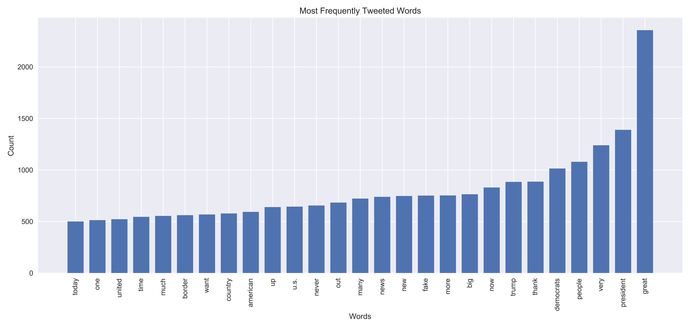

 

# Does the Market Move with Trump's Tweets?
**Identifying how the market correlates with the content and volume of Trump's tweets**
 Walker Stevens
\
[Linkedin](https://www.linkedin.com/in/walker-stevens-31783087/) | [Github](https://github.com/walker777007)
\
[Slides](https://docs.google.com/presentation/d/1CAraqaHrIOvwTRTMnkqVxcKBLObsxW4V1REe9X0WVw8/edit?usp=sharing)

## Table of Contents

* [Motivation](#motivation)
* [Data Exploration](#data-exploration)
  * [Pipeline](#pipeline)
  * [Evidence for the Motivation](#evidence-for-the-motivation)
  * [What is Trump Talking About?](#what-is-trump-talking-about?)
  * [Daily Effects](#daily-effects)
  * [Change Assumptions](#change-assumptions)
* [Hypothesis Testing](#hypothesis-testing)
  * [Set-Up](#set-up)
  * [Mann Whitney U Test](#mann-whitney-u-test)
* [Conclusion](#conclusion)

## Motivation

Donald Trump has been known for being quite "outspoken" on his twitter, and I have read a [host](https://www.mediaite.com/news/stock-market-plunges-223-points-in-5-minutes-after-trumps-stunning-china-tweets/) [of](https://www.barrons.com/articles/donald-trump-twitter-stock-market-51567803655) [articles](https://www.forbes.com/sites/johntobey/2019/09/07/how-tweet-risk-can-infect-your-stock-investing-and-how-to-avoid-harm/#2ab88f423330) discussing the relationship of his tweets with the stock market.  I was curious if I could quantify this relationship, to see if the content and volume of his tweets were correlated with market drops or increased volatility.

The indexes I used in this case are:

* **S&P500**: Represents the performance of 500 large companies listed on stock exchanges.
* **VIX**: Represents investor "fear". To quote Wikipedia, it "represents the expected range of movement in the S&P 500 index over the next month... For example, if the VIX is 15, this represents an expected annualized change, with a 68% probability, of less than 15% up or down."
* **Soybean Futures**: Represents the price of 5,000 bushels of soybeans.  The reason I chose this index, was due to the fact that China is a major importer of US soybeans, so it has been greatly affected by the trade war.

## Data exploration

### Pipeline

Where I got the data:
* Trump's Tweets: [Trump Twitter Archive](http://www.trumptwitterarchive.com/)
  * The Trump Twitter Archive provides a part of the twitter API data for every tweet Trump has ever tweeted.
* S&P500 and VIX Historical Data: [Yahoo! Finance](https://finance.yahoo.com/)
* Soybean Futures Historical Data: [Investing.com](https://www.investing.com/)

Once all the data CSV files were collected, I used pandas in order to group them into dataframes, and proceeded to do all my calculations and tests after.

### Evidence for the Motivation

The tariff period of Trump's presidency started in January of 2018, when he announced tariffs on solar panels and washing machines.  He would go on to announce additional tariffs on steel, aluminum, and goods at large from China.  

As we can see below, the market has been more volatile ever since.

On May 30th, 2019, [Trump threatened to introduce tariffs](https://www.cnn.com/2019/05/30/investing/mexico-tariffs-stock-reactions/index.html) on Mexico unless they stop illegal immigration into America, the Dow Jones Industrial Average dropped 385 points that day.

On August 23rd, 2019 at 10:57am, Trump proceeded to go on a twitter storm about the trade war with China.  Within 10 minutes, the Dow Jones Industrial Average had dropped 373 points.

Here we can see an illustration of that fateful moment.

Another interesting specific case is on May 9th, 2019 China decided to cancel soybean orders responding to tariffs Trump introduced beginning in March.  As a result, soybean futures plummetted, and Trump's twitter exploded.

 Here we can see an illustration this other fateful moment.

### What is Trump Talking About?

Before I went on to analyze his tweets in comparison to market movement, I thought it would be interesting to see what Trump has been tweeting about over the course of his presidency.

In the plot below, we can see which words, ignoring nondescript words, are most frequently used.  Unsurprisingly, words like big, very, and fake are used quite a lot.  As well, he used an exclamation point 8,648 times in his tweets.  Huge!

In the plot below, we can see how many tweets Trump has been making, and it seems like he has just been tweeting more and more as his presidency goes on.  Wow!

In this plot, we can see how many tweets on a given day are regarding the trade war, the federal reserve, and his impeachment.

The keywords contained in trade_war: "Xi", "China", "Tariff", "NAFTA"  

The keywords contained in fed: "Fed", "Federal Reserve", "Interest Rates", "Powell", "Inflation"

The keywords contained in impeachment: "Impeach", "Witch"

We can see a spike in the mentions of the trade war during the time period I spoke of earlier.  The spike in the federal reserve tweets occurred when the Fed lowered interest rates in September of 2019.  The mentions of impeachment, spiked dramatically once the Ukraine scandal became known and once Nancy Pelosi drafted the articles of impeachment.  Sad!

### Daily Effects

My first assumption was that Trump's tweets were correlated daily with the price drop in the S&P500.  However this appeared to not be the case.

I then did the same correlation with VIX instead of the S&P500, and the result was slightly more promising, albeit the correlation was still very weak, only being 0.14 and 0.08.

### Change Assumptions

It appears that looking at daily effects are too random and arbitrary for several reasons.  The trends either caused by or correlated to the volume of Trump's tweets tend to be larger than a day by day basis.  As well, sometimes Trump will tweet a great deal about a subject on a given day, then have an off day.  Treating that 2nd day as independent of the 1st would not make as much sense, since the market has already moved in correlation with the prior day(s), and the market would be low/volatile despite the fact that Trump had not tweeted that day.  For this reason, I decided to group by what I call "Trading Week", which is Friday after market close to the next Friday close.  To calculate volatility, I simply took the maximum price of the week subtracted by the lowest price in the same week.

 VIX High simply denotes the maximum VIX value in that week, which can be understood as the maximum investor fear for the week.  As well, instead of simply looking at the absolute numbers of tweets that were about the trade war or federal reserve, I decided to look at the percentage of tweets that week that were about those subjects.

This had an immediate noticeable effect on the correlation, which can be seen below.  The correlation coefficients for all 3 indexes were roughly about the same for the percentage of tweets about the trade war: 0.24,0.27,0.26.

## Hypothesis Testing

### Set-Up

To actually run a hypothesis test on whether Trump's tweets are correlated with the volatility in the market, I split up the weeks with a high percentage of tweets relating to the trade war and weeks with a low percentage of tweets relating to the trade war into two separate distributions.  For the federal reserve, he doesn't tweet about it as often, so the 2 distributions were whether he tweets about it in a given week and if he doesn't.  

My null hypothesis is that weeks with a high percentage of tweets about the trade war (in the case of federal reserve, simply mentioning it at all) will have equal or less market volatility compared to weeks with low percentage of tweets about the trade war (in the case of federal reserve, no mentions).

### Mann Whitney U Test

None of the distributions are normal, so in order to calculate our p values we have to use the [Mann Whitney U Test](https://en.wikipedia.org/wiki/Mann%E2%80%93Whitney_U_test).
As we can see in all 5 cases below, we can reject the null hypothesis since our p values are all less than α=0.05.

## Conclusion

Correlation != Causation.  Unfortunately I can’t say that Trump’s tweets are actually affecting market movement, seemingly outside of certain singular cases.  I can’t tell you when to buy or sell based on what he is saying, sadly.  However, it does appear that when Trump tweets a significant amount about the Trade War or about the Federal Reserve, the markets are more volatile.  Investors seem to be more “scared” when he tweets a lot.  Are they scared of his tweets or are the tweets in response to the fear?

Some important questions that could explain the movement:
Are the volume of his tweets representing new policy that is affecting the market? Is he tweeting in response to poor market activity? Have investors become jaded enough that they are less concerned with what Trump is saying 3 years into his presidency?
